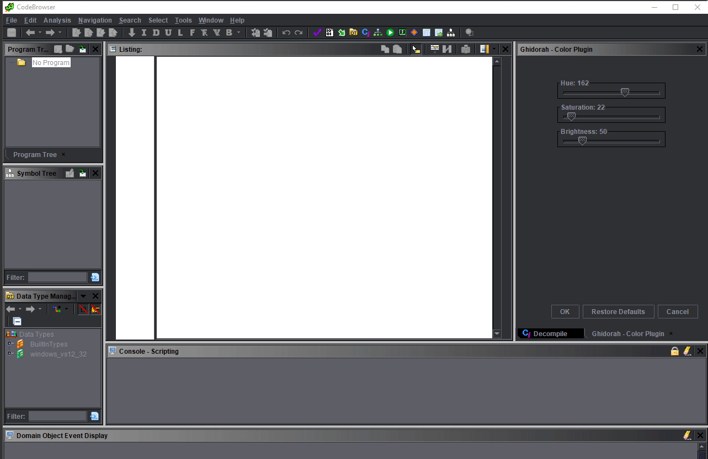

# Ghidorah

#### Ghidra - Ghidorah Plugin

## Brief

This is a simple plugin which provides different colors to the GHIDRA decompiler's environment.

## Demo

## Todo

+ Taskbar Icon
+ Update Documentation
+ Display Preview Sample
+ Auto Configuration Saving
+ Selected Window Colorization

## License

This project is licensed under the [Apache License 2.0 (Apache-2.0)][ref-AP2]. See the [LICENSE.md](./LICENSE.md) file for details.

[ref-AP2]: https://tldrlegal.com/license/apache-license-2.0-(apache-2.0)
